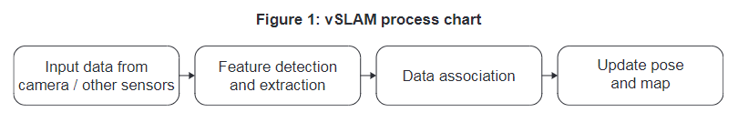
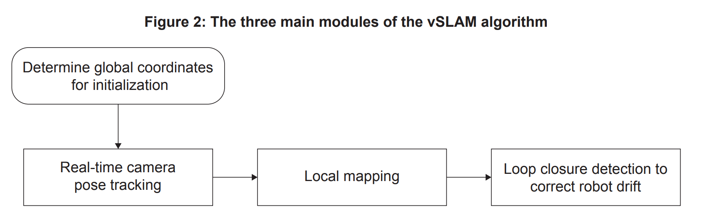
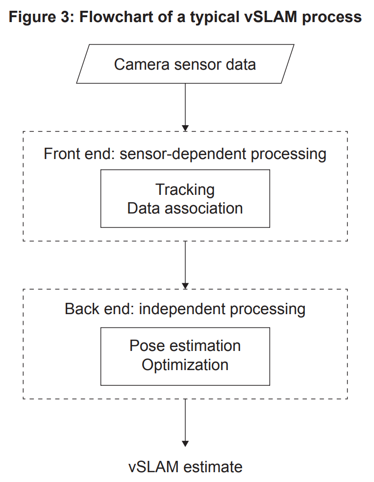

# Rescue Robots

## Important links:
- [Actual case study](./rescue_robots.pdf)
- [Computer Science wiki for vocabulary](https://computersciencewiki.org/index.php?title=2024_case_study)

## Overview

1. [Scenario](#scenario)
2. [Problems to be addressed](#problems)
3. [Technologies](#tech)
    1. [Computer vision](#cv)
        1. [Visual simultaneous localization and mapping (vSLAM)](#vslam)
        2. [Pose estimation](#pose-estimation)
4. [Social and ethical issues](#issues)
5. [Further research](#research)
6. [Challenges faced](#challenges)
7. [Additional terminology](#terms)

##  Scenario

- **BotPro**:
    - Company that makes robots for various industrial applications
    - Focus shifted to making **rescue robots**

- **Rescue robots**:
    - Designed to help with the search and rescue of humans after a **disaster** (earthquakes and tsunamis)
    - Assist the efforts of rescue teams by **searching** and **mapping** areas, assessing damage, removing debris, delivering supplies, and evacuating casualties

- Found to perform below expectations when sent into a large factory after a fire and another factory that was damaged by an earthquake

- Robot had trouble **navigating the factories** and **reaching the exact location of survivors**

- However, operation was successful when deployed in a stadium after strucutural damage

- Root cause was the accuracy and difference  of the [`global positioning system (GPS) signal`](#gps) inside the factories
    - Strength of the satellite signal received was **insufficient**, resulting in errors in calculating robot's exact location
    - Factories were also an **unknown environement** to the robot
    - Damage caused meant that the **layout of the factories was different to any floor plans that existed**

##  Problems to be addressed

- Redesgining of robot with the capability to **explore**, **map**, and **survey the interior of unknown and damaged buildings**

- Must be **cost effective** and focus on the new design was on **building efficient algorithms** to **improve robot performance** and not on the mechanical components

1. `Accurate mapping of the area`: robot needs to find its way inside buildings and reliably operate in a [`GPS-degraded environment`](#gps-degraded) or [`GPS-denied environment`](#gps-denied) and **in the absence of an exact map**
2. `Navigation in a dynamic and unknown enviroment`: robot has to **navigate in an unknown environment** where structures may have been **damaged and changed due to the disaster**
3. `Finding survivors`: robot required to **detect debris and humans under different light conditions**, deal with **[`occlusion`](#occlusion) by objects**, and **recognize deformed shapes**
4. `Communication`: robots must **communicate with rescue team outside the damaged space**. Robot may need to rely on **large databases** and the **processing power of central computers**

##  Technologies

- In order to move around the **environment successfully**, the robot needs a **map**

- [`GPS signals`](#gps) usually used for **navigation in open spaces** since received **signals are accurate**, unlike for indoor spaces

- Hence, the design team at *BotPro* needs to create a **visual situational awareness** and are looking at **[`computer vision`](#computer-vision) techniques** to allow the robot to **produce a map of its surroundings** and **recognize objects not seen before**

- Robot must be equipped with an [`odometry sensor`](#odometry-sensor) and a single **camera** at the most basic level

###  Computer vision
---

- Refers to technologies that allow a device to **"see"**, i.e., **sense the environment around it**, including both **static** and **dynamic objects**

- Two subdomains of [`computer vision`](#computer-vision) being explored include:
    - [`Visual simultaneous localization and mapping (vSLAM)`](#vslam)
    - [`Pose estimation`](#pose-estimation)

####  Visual simultaneous localization and mapping (vSLAM)
---

- [`Simultaneous localization and mapping (SLAM)`](#slam) is used for **estimating sensor motion** and **reconstructing the structure of an unknown environment**

- [`SLAM`](#slam) can be performed using different types of **sensors** including:
    - cameras for **visual data** collection
    - radar
    - sonar
    - [`light detection and ranging (LIDAR)`](#lidar) for **non-visible data**
    - [`inertial measurement unit (IMU)`](#imu) for **basic positional data**

- [`IMU`](#imu) is a **combination of sensors**, such as an `accelerometer`, `gyroscope`, and `magnetometer`, that **capture the data about a device's location** in a **three-dimensional (3D) space**

- Installing an [`IMU`](#imu) on the robot will allow it to measure its **translational and rotational movements**

- [`SLAM`](#slam) techniques that use a **camera as the basic visual input** are know as [`vSLAM`](#visual-slam) or [`visual SLAM`](#visual-slam)

- [`vSLAM`](#visual-slam) algorithms will allow the robot to **dynamically build a map** while **keeping track of its own location and orientation** as it moves around an **unknown environment**

- The objective is to **combine** the [`dead reckoning data`](#dead-reckoning-data) provided by the [`odometry sensor`](#odometry-sensor) and **images from the camera** as an **input** to undertake `localization` and **map building**

- [`vSLAM`](#visual-slam) works indoor and provides greater accuracy than [`GPS`](#gps) (advantage)

- [`vSLAM`](#visual-slam) algorithm has a number of **modules**, the *three* main ones being:
    - `tracking`
    - `local mapping`
    - `loop closure`

- Robot uses the ***three* main modules** of the [`vSLAM`](#visual-slam) algorithm to:
    - [`initialize`](#initialization) its position according to the available data
    - [`track`](#tracking) its progress while analyzing new sensor data
    - **create a map** of the environment

- As the measurement of features (doors, wall corners, location/pose of people in damaged structure) *increases* over time, the **environment representation** needs to be **optimized**, which requires significant **computational processing capabilites** (**Figure 3**)

- **Balance** is needed between the `efficiency of the optimizing algorithms` and the `accuracy of the created map`

- Two techniques used for [`optimization`](#optimization) are [`bundle adjustment`](#bundle-adjustment) and [`keyframe selection`](#keyframe-selection)

####  Pose estimation
---

##  Social and ethical issues

##  Further research

##  Challenges faced

##  Additional terminology

- <a id="bundle-adjustment">`Bundle adjustment`</a>
- <a id="computer-vision">`Computer vision`</a>
- <a id="dead-reckoning-data">`Dead reckoning data`</a>
- <a id="edge-computing">`Edge computing`</a>
- <a id="global-map-optimization">`Global map optimization`</a>
- <a id="gps">`Global positioning system (GPS) signal`</a>
- <a id="gps-degraded">`GPS-degraded environment`</a>
- <a id="gps-denied">`GPS-denied environment`</a>
- <a id="hpe">`Human pose estimation (HPE)`</a>
- <a id="imu">`Inertial measurement unit (IMU)`</a>
- <a id="keyframe-selection">`Keyframe selection`</a>
- <a id="key-points">`Key points/pairs`</a>
- <a id="lidar">`Light detection and ranging (LIDAR)`</a>
- <a id="occlusion">`Object occlusion`</a>
- <a id="odometry-sensor">`Odometry sensor`</a>
- <a id="optimization">`Optimization`</a>
- <a id="relocalization">`Relocalization`</a>
- <a id="rpe">`Rigid pose estimation (RPE)`</a>
- <a id="robot-drift">`Robot drift`</a>
- <a id="slam">`Simultaneous localization and mapping (SLAM)`</a>
- <a id="sensor-fusion-model">`Sensor fusion model`</a>
- <a id="visual-slam">`Visual simultaneous localization and mapping (vSLAM) modules`:</a>
    - <a id="initialization">`Initialization`</a>
    - <a id="local-mapping">`Local mapping`</a>
    - <a id="loop-closure">`Loop closure`</a>
    - <a id="relocalization">`Relocalization`</a>
    - <a id="tracking">`Tracking`</a>

