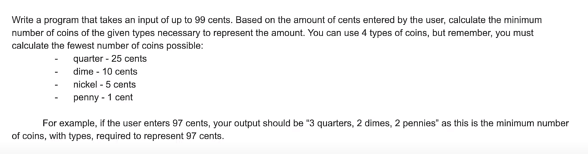

# Practice 1

    // 36
    input CENTS

    // validation

    loop while CENTS > 99 or CENTS < 0
        output "Enter a valid number of cents"
        input CENTS
    endloop

    QUARTERS = CENTS div 25 // 1
    REMAINING = CENTS mod 25 // 11
    output "Quarters: ", QUARTERS

    DIMES = REMAINING div 10 // 1
    REMAINING = REMAINING mod 10 // 1
    output "Dimes: ", DIMES

    NICKELS = REMAINING div 5 // 0
    REMAINING = REMAINING mod 5 // 1
    output "Nickels: ", NICKELS

    PENNIES = REMAINING div 1 // 1
    REMAINING = REMAINING mod 1 // 0
    output "Pennies: ", PENNIES
