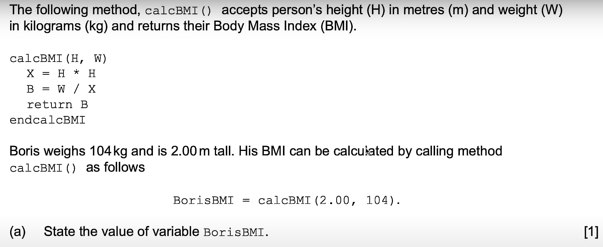

# Practice 2

a) `26.0`

b)

    method categorize(BMI)
        if BMI < 18.5 then
            output "underweight"
        else if BMI < 25.0 then
            output "normal weight"
        else if BMI < 30.0 then
            output "overweight"
        else
            output "obese"
        end if
    end method

        
