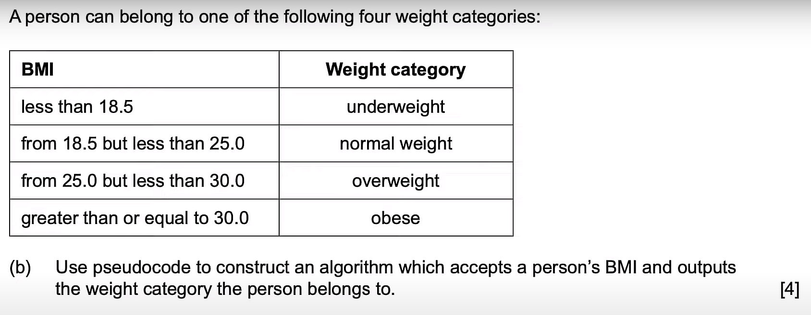

# Practice 2

a) `26.0`

b)

    method categorize(BMI)
        if BMI < 18.5 then
            output "underweight"
        else if BMI < 25.0 then
            output "normal weight"
        else if BMI < 30.0 then
            output "overweight"
        else
            output "obese"
        end if
    end method

c) `Paul`

d) i) The `HEIGHT` array is not sorted which is why binary search cannot be used

d) ii) Linear search can be used to find the position (array index) of a given height measurement in the `HEIGHT` array and the name in the `NAME` array at the found position should be outputted.

e)

1. Get the group's average BMI
2. Compare the average BMI to the individual BMI of each member
3. Output the names of those who have higher than average
--- 
    // height, weight
    calcBMI(H, W)

    NAME[30], WEIGHT[30], HEIGHT[30]
---
    SUM = 0
    loop I from 0 to NAME.length - 1
        SUM = SUM + calcBMI(HEIGHT[I], WEIGHT[I])
    end loop
    AVG_BMI = SUM/30

    loop J from 0 to NAME.length - 1
        if calcBMI(HEIGHT[J], WEIGHT[J]) > AVG_BMI then
            output NAME[J]
        end if
    end loop